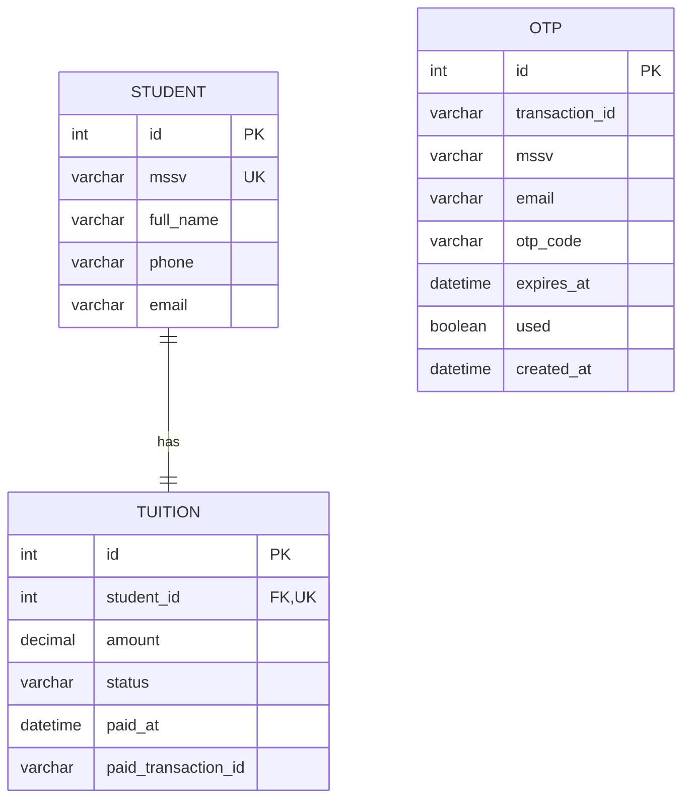

# ERD - TV2

```mermaid
erDiagram
    STUDENT ||--|| TUITION : has
    STUDENT {
        int id PK
        varchar mssv UK
        varchar full_name
        varchar phone
        varchar email
    }

    TUITION {
        int id PK
        int student_id FK,UK
        decimal amount
        varchar status
        datetime paid_at
        varchar paid_transaction_id
    }

    OTP {
        int id PK
        varchar transaction_id
        varchar mssv
        varchar email
        varchar otp_code
        datetime expires_at
        boolean used
        datetime created_at
    }
```

`OTP.transaction_id` liên kết logic với transaction do TV3 quản lý. TV2 không sở hữu bảng transaction của TV3.
