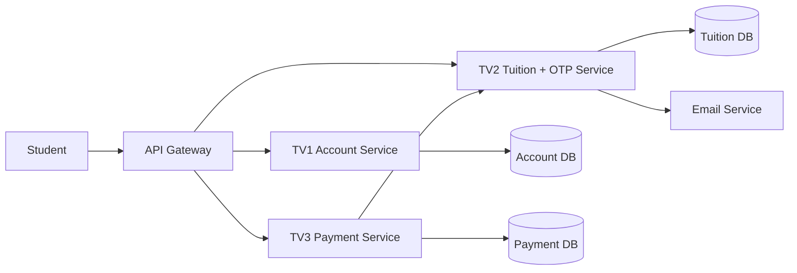

# Microservices Architecture - Nhóm 3 thành viên

## TV2 responsibilities

- Tra cứu học phí.
- Cung cấp dữ liệu cho màn hình chọn khoản học phí.
- Tạo và gửi OTP.
- Xác thực OTP.
- Cập nhật trạng thái học phí sau khi TV3 thanh toán thành công.
- Đảm bảo chỉ một giao dịch chuyển khoản học phí từ UNPAID sang PAID.

## Communication

- Frontend -> API Gateway -> TV2.
- TV3 -> TV2 qua REST API nội bộ.
- TV2 -> Email service/SMTP để gửi OTP.
