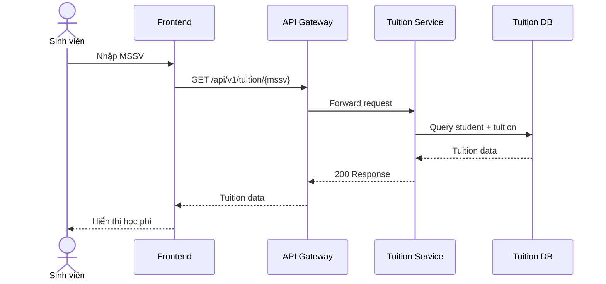
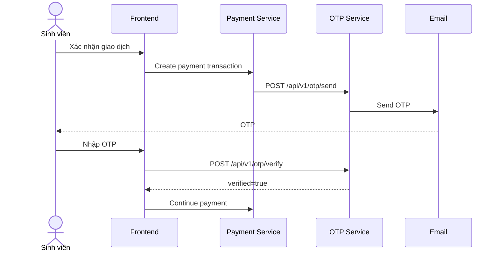
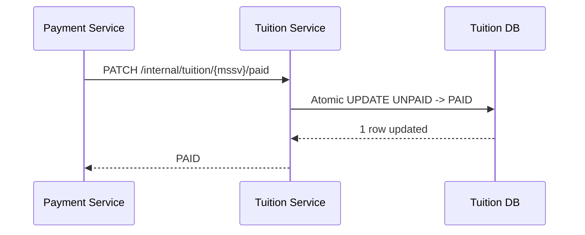

# Sequence Diagrams

## Tra cứu học phí

```mermaid
sequenceDiagram
    actor SV as Sinh viên
    participant FE as Frontend
    participant GW as API Gateway
    participant TV2 as Tuition Service
    participant DB as Tuition DB

    SV->>FE: Nhập MSSV
    FE->>GW: GET /api/v1/tuition/{mssv}
    GW->>TV2: Forward request
    TV2->>DB: Query student + tuition
    DB-->>TV2: Tuition data
    TV2-->>GW: 200 Response
    GW-->>FE: Tuition data
    FE-->>SV: Hiển thị học phí
```

## Gửi và xác thực OTP

```mermaid
sequenceDiagram
    actor SV as Sinh viên
    participant FE as Frontend
    participant TV3 as Payment Service
    participant TV2 as OTP Service
    participant MAIL as Email

    SV->>FE: Xác nhận giao dịch
    FE->>TV3: Create payment transaction
    TV3->>TV2: POST /api/v1/otp/send
    TV2->>MAIL: Send OTP
    MAIL-->>SV: OTP
    SV->>FE: Nhập OTP
    FE->>TV2: POST /api/v1/otp/verify
    TV2-->>FE: verified=true
    FE->>TV3: Continue payment
```

## Cập nhật học phí

```mermaid
sequenceDiagram
    participant TV3 as Payment Service
    participant TV2 as Tuition Service
    participant DB as Tuition DB

    TV3->>TV2: PATCH /internal/tuition/{mssv}/paid
    TV2->>DB: Atomic UPDATE UNPAID -> PAID
    DB-->>TV2: 1 row updated
    TV2-->>TV3: PAID
```
